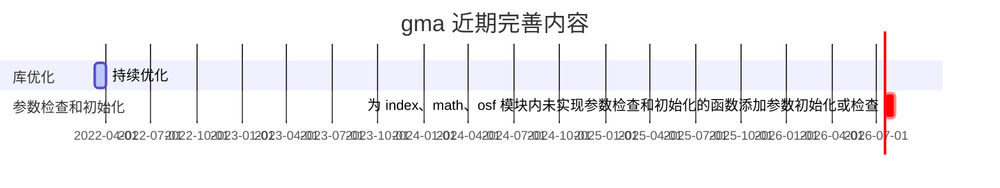

## 更新前瞻

## 更新测试中的新内容

&emsp;　更新测试中的新内容将在下一个 gma 版本中发布。下一版本 **1.0.6** 。

<i class="fas fa-box"></i> **引入 [constants](/Functions/Constants.html) 常量模块。** 提供数学常量、国际单位制词头、二进制单位、长度单位、面积单位等 16 种单位的名称、值或与国际单位的代换值！

<i class="fab fa-superpowers"></i> **优化：**

&emsp;　1、FillNoData

&emsp;　　所有的插补方法支持的类型移入 key 中。（内部修改，不影响函数功能。）

&emsp;　2、TRANCoordinate

&emsp;　　优化距离计算算法。现在，即使坐标点跨度巨大，仍能准确的返回计算结果。

&emsp;　3、版本记录

&emsp;　　增加当前 gma 版本号记录。可通过 gma.\_\_version\_\_ 查看当前版本号。

&emsp;　4、Resample、ChangeDataType

&emsp;　　改进算法，提高效率。大文件处理时间缩短超过 30% 。

&emsp;　5、rasp

&emsp;　　对模块内函数进行了改造。已实现对输入栅格数据正确性的判断。

<i class="fas fa-award"></i> **新增：**

&emsp;　1、增加 [ToNumericArray](/UserGuide/math.html#tonumericarray) 函数

&emsp;　　强制将输入数据转为数字型数组，无法转换的值将会被修改为 nan。引用：gma.math.ToNumericArray。

&emsp;　2、增加 [Simplify](/UserGuide/vesp.html#simplify) 函数

&emsp;　　简化矢量数据中的要素。引用：gma.vesp.Simplify。

&emsp;　3、增加 [FixGeometry](/UserGuide/vesp.html#fixgeometry) 函数

&emsp;　　修正矢量数据中无效的几何要素。引用：gma.vesp.FixGeometry。

&emsp;　4、增加顶层 [Open](/UserGuide/other.html#open) 函数

&emsp;　　以替代 gma.rasp(vesp).Open 函数（这两个函数仍可用）。引用：gma.Open。

<i class="far fa-trash-alt"></i> **移除：**

&emsp;　1、_DFToNumeric

&emsp;　　移除了 _DFToNumeric 函数，相关功能合并至 ToNumericArray 函数。

<i class="fas fa-tools"></i> **修复**

&emsp;　1、SplitImage

&emsp;　　修复了部分条件下，切片不能正常执行的问题。

&emsp;　2、ToVector

&emsp;　　修复了部分条件下，掩膜 NoData 区域异常的问题。

<i class="fas fa-exclamation-circle"></i> **已知问题：**

&emsp;　1、Float64

&emsp;　　将数据写出为双精度浮点数（Float64）时，数据结果可能异常。请尽量使用单精度浮点数（Float32）或半精度浮点数（Float16）来存储浮点类型的栅格数据结果！
